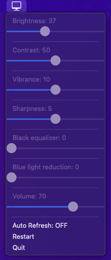

# Gigabyte M27Q Settings Controller



This application allows you to control the Gigabyte M27Q settings via USB.
The app will appear in the macOS menu bar. Click the icon to access and adjust the monitor settings.
This fork aims to create a status bar application to control key monitor settings in macOS.
The following settings are available.

1. Brightness
2. Contrast
3. Vibrance
4. Sharpness
5. Volume

The core implementation was based on [this gist](https://gist.github.com/wadimw/4ac972d07ed1f3b6f22a101375ecac41).

## Installation Instructions

1. Install [libusb](https://libusb.info/)
    1. Install using homebrew
        ```shell 
        brew install libusb
        ```
    2. Create a symbolic link in your home directory
        ```shell
        ln -s /opt/homebrew/lib ~/lib
        ```
2. Download the DMG file from [releases](https://github.com/mithwick93/Gigabyte-M27Q-Settings-Controller/releases) and
   open it.
3. Drag the `Gigabyte M27Q Settings Controller.app` to the Applications folder.

## Development

### Requirements

1. Git
2. Python 3 and pip
3. create-dmg (optional, required only for dmg creation)

### Setup

1. Clone the repository:

    ```shell
        git clone https://github.com/mithwick93/Gigabyte-M27Q-Settings-Controller.git
        cd Gigabyte-M27Q-Settings-Controller
    ```

2. Install the dependencies:

    ```shell
        pip install -r requirements.txt
    ```

3. Run the application locally

    ```shell
        python main.py
    ```

### Build the macOS app:

App will be created as  ``dist/Gigabyte M27Q Settings Controller.app``

```shell
    python setup.py py2app
```

### Create a DMG installer (optional)

Dmg will be created as ``dist/Gigabyte M27Q Settings Controller.dmg``

```shell
    create-dmg \
      --volname "Gigabyte M27Q Settings Controller" \
      --background "resources/icon.png" \
      --window-pos 200 120 \
      --window-size 800 400 \
      --icon-size 100 \
      --icon "Gigabyte M27Q Settings Controller.app" 200 190 \
      --hide-extension "Gigabyte M27Q Settings Controller.app" \
      --app-drop-link 600 185 \
      "dist/Gigabyte M27Q Settings Controller.dmg" \
      "dist/Gigabyte M27Q Settings Controller.app"
```
